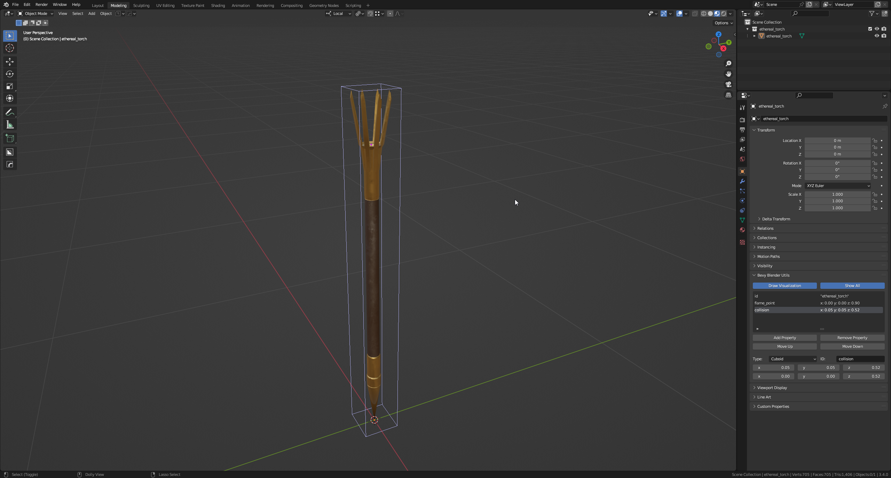

# bevy_blender_utils

This is influenced by both [bevy-scene-hook](https://github.com/nicopap/bevy-scene-hook) and
[blender_bevy_toolkit](https://github.com/sdfgeoff/blender_bevy_toolkit).

**This is a proof-of-concept at this point. I need to dogfood this, but my project is still on 0.9.**

## What this is and what this isn't?

BBU (Blender Bevy Utils) consist of two parts;
- BBU Addon: A Blender addon that allows extra data to be set on objects.
- BBU Companion Crate: An opinionated way of using data generated by the addon.

This repo includes both source codes.

The Aim of BBU is to allow prefab-like workflow while still maintaining the code-first approach of editor-less Bevy.
BBU only provides simple primitives like f32, Vec3 or Cuboid; while instantiating components with it is done through
code. While this still requires some work to be done manually using code, it provides visual feedback using Blender as
an editor and a clear asset workflow to follow. I prefer this because (my opinionated thoughts);

- Parsing components from GLTF is too much work.
- Blender as a base isn't enough for a game engine-like experience; making it using limited addon functionality is too
much work.

So, this is more like ``bevy-scene-hook``'s approach; and can be used with it without this companion crate. I don't
know if it is possible to do the hot-reload with my approach.

## Installation of addon

You can clone the repository, zip [bevy_blender_utils](bevy_blender_utils) and import it as a Blender addon.

## Usage

Usage is user-dependent, but the workflow I prefer can be found on [examples](examples). In short, it is like this:
- Add plugin.
- Have an id field for all scene-objects that needs care.
- Create an enum and add a ``snake_case`` deserializer with ``id`` being the tag.
- Profit.

Addon can be used with library override, which is **awesome**. Please open an issue if you need documentation on it!

## Bevy Compatibility

| Bevy Version | Crate Version | Plugin Version |
|--------------|---------------|----------------|
| `0.10`       | `0.1`         | `0.1`          |

## Blender Compatibility

Minimum Blender version: `3.4.0`

## Todo
- Tidy up python code and document it (there are lots of edge cases handled).
- Maybe improve documentation, if possible.
- Hide ``Id`` for basic usage.
- Multi-color support.
- Explore hot-reload possibility.

## License

Licensed under either of

* Apache License, Version 2.0
  ([LICENSE-APACHE](LICENSE-APACHE) or http://www.apache.org/licenses/LICENSE-2.0)
* MIT license
  ([LICENSE-MIT](LICENSE-MIT) or http://opensource.org/licenses/MIT)

at your option.

## Contribution
Unless you explicitly state otherwise, any contribution intentionally submitted for inclusion in the work by you,
as defined in the Apache-2.0 license, shall be dual licensed as above, without any additional terms or conditions.